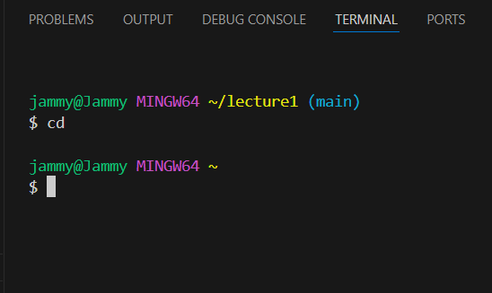
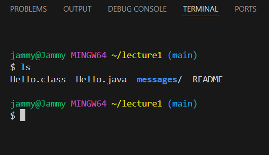
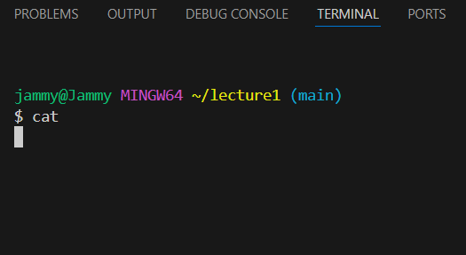
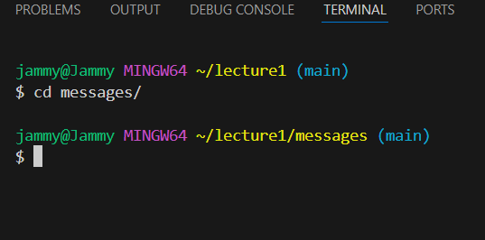
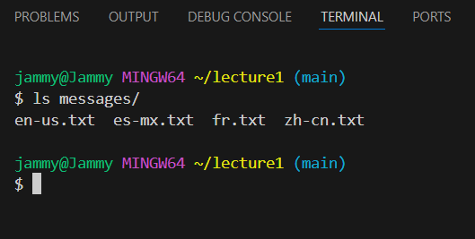
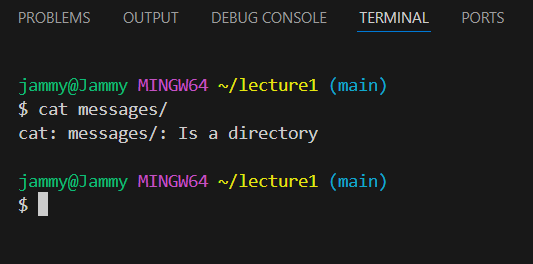
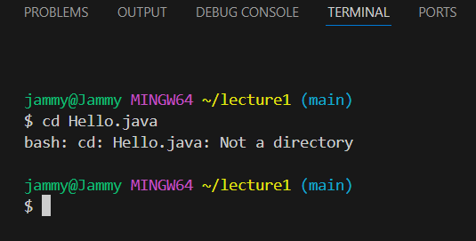
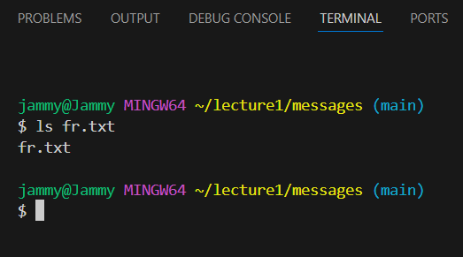
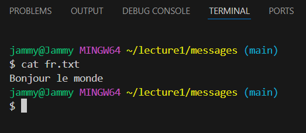

## Lab Report 1
1a. The ```cd``` command is used to switch the current working directory to the given path. Using this command with no arguments exits the current directory to the parent directory. For example, the absolute path could be ```/home/lecture1``` and the ```cd``` command with no arguments brings the user to ```/home```.  
  
The absolute path to the working directory before the command was run was ```/c/Users/jammy/lecture1```. We got this output because having no arguments for this command means that it will change to the home directory by default. This output is not an error.  

1b. The ```ls``` command is used to list files and folders in the given path. Using this command with no arguments outputs files and folders in the current specified path. For example, the absolute path could be ```/home/lecture1``` and the ```ls``` command with no arguments lists files within the ```lecture1``` directory, such as ```Hello.class```, ```Hello.java```, ```messages/```, and ```README```.  
  
The absolute path to the working directory before the command was run was ```/c/Users/jammy/lecture1```. We got this output because having no arguments for this command means that it will list all items in the current path. This output is not an error.  

1c. The ```cat``` command is used to print contents of one or more files given by the paths specified after the command. Using this command with no arguments prints nothing in the terminal. For example, the absolute path could be ```/home/lecture1``` and the ```cat``` command with no arguments returns nothing.  
  
The absolute path to the working directory before the command was run was ```/c/Users/jammy/lecture1```. We got this output because having no arguments for this command means that it will print no content as no path was given. This output is not an error.  

2a. An example of using the ```cd``` command with a path to a directory as an argument would be if the current path is ```/home/lecture1```, then ```cd messages/``` would bring the user to ```/home/lecture1/messages```.  
  
The absolute path to the working directory before the command was run was ```/c/Users/jammy/lecture1```. We got this output because a relative path ```messages/``` was given, which allows the command to change to the ```messages``` directory. This output is not an error.  

2b. An example of using the ```ls``` command with a path to a directory as an argument would be if the current path is ```/home/lecture1```, then ```ls messages/``` would list the files within messages, such as ```en-us.txt```, ```es-mx.txt```, ```fr.txt```, and ```zh-cn.txt```.  
  
The absolute path to the working directory before the command was run was ```/c/Users/jammy/lecture1```. We got this output because a relative path ```messages/``` was given, allowing for the command to list the items in the path. This output is not an error.  

2c. An example of using the ```cat``` command with a path to a directory as an argument would be if the current path is ```/home/lecture1```, then ```cat messages/``` would print an error message stating that ```messages/``` is a directory.  
  
The absolute path to the working directory before the command was run was ```/c/Users/jammy/lecture1```. We got this output because the command is used to print contents within files and not directories like ```messages```. Instead, the ```messages``` directory is a folder with txt files that have contents inside them. This is an error because the system printed out a message that describes the given argument rather than printing out contents as expected.  

3a. An example of using the ```cd``` command with a path to a file as an argument would be if the current path is ```/home/lecture1```, then ```cd Hello.java``` would print an error message stating that ```Hello.java``` is not a directory.  
  
The absolute path to the working directory before the command was run was ```/c/Users/jammy/lecture1```. We got this output because despite ```Hello.java``` being an existing file in the current working directory ```lecture1```, the system responds with the above error message as it is not a directory. The command is then unable to change into the path. This is an error because the system printed out a message that describes the result of incorrect usage of the command.  

3b. An example of using the ```ls``` command with a path to a file as an argument would be if the current path is ```/home/lecture1/messages```, then ```ls fr.txt``` would return the existing file name ```fr.txt```.  
  
The absolute path to the working directory before the command was run was ```/c/Users/jammy/lecture1/messages```. We got this output because the file provided is the only file that exists in the ```messages``` directory and therefore the command was able to output its file name. This output is not an error.  

3c. An example of using the ```cat``` command with a path to a file as an argument would be if the current path is ```/home/lecture1/messages```, then ```cat fr.txt``` would print the contents within the file, ```"Bonjour le monde"```.  
  
The absolute path to the working directory before the command was run was ```/c/Users/jammy/lecture1/messages```. We got this output because the file given has contents inside, which could be printed out. This output is not an error.
