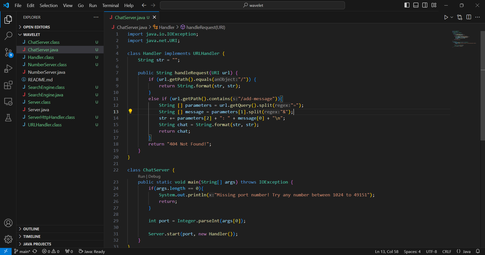
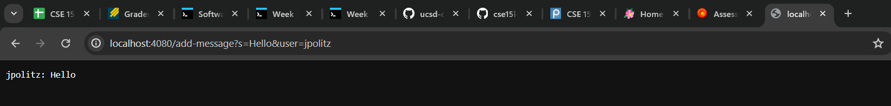
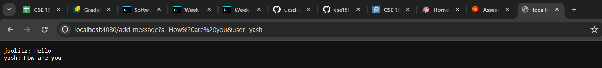
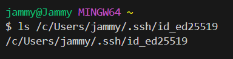
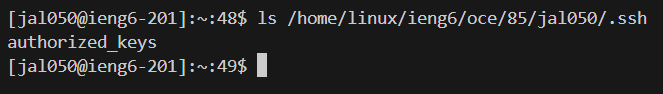
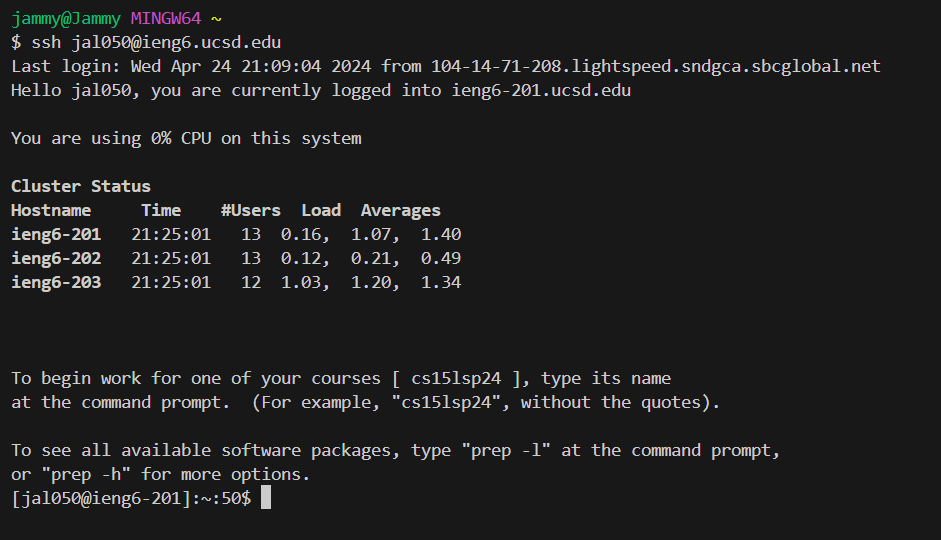

# Lab Report 2
# Part 1  
  
  
1a. For the first screenshot, the ```main``` and ```handleRequest``` methods were called.  
1b. The relevant argument to the ```main``` method was a unique number between 1024 and 49151, which was 4080. The relevant argument to the ```handleRequest``` method was the ```url``` or webserver we were able to initiate after compiling and running ```Server.java``` and ```ChatServer.java``` with the port number. This turned out to be ```http://localhost:4080/```, but with the request, it is ```http://localhost:4080/add-message?s=Hello&user=jpolitz```. The value of the relevant field ```str``` in the class ```Handler``` was an empty string.  
1c. The value of ```str``` changed with this specific request when the ```url``` was checked for ```/add-message```, which prompted the splitting of the link's query element. It was split by the equal sign to achieve the user's name before being split again by the ```&``` symbol for the user's message, all stored in their respective arrays ```parameters``` and ```message```. The arrays were used to create a string that will update ```str``` with ```jpolitz: Hello```.  
  
  
2a. For the second screenshot, the ```handleRequest``` method was called.  
2b. The relevant argument to the ```handleRequest``` method was the ```url``` with the request, which is ```http://localhost:4080/add-message?s=How are you&user=yash```. The value of the relevant field ```str``` in the class ```Handler``` was the string from the previous request ```jpolitz: Hello```.  
2c. The value of ```str``` changed with this specific request when the ```url``` was checked for ```/add-message```, which goes through the same steps as the previous request with the splitting. The arrays were used to create a string in the next line that the previous request was able to set up with ```"\n"```, which could be appended to ```str```. The updated ```str``` will have the messages ```jpolitz: Hello``` and ```yesh: How are you``` in separate lines with the latter after the former.  
  
# Part 2  
1. 
2. 
3. 

# Part 3  
1. Something I learned from lab in week 3 that I didn't know before was being able to generate a secure password that could be copied into a remote server so that I could access the server without having to manually type in my actual password every time I log in. I was surprised by how efficient it was, although I am still confused about the purpose of the key's randomart image is and whether that could be used as a password as well.
