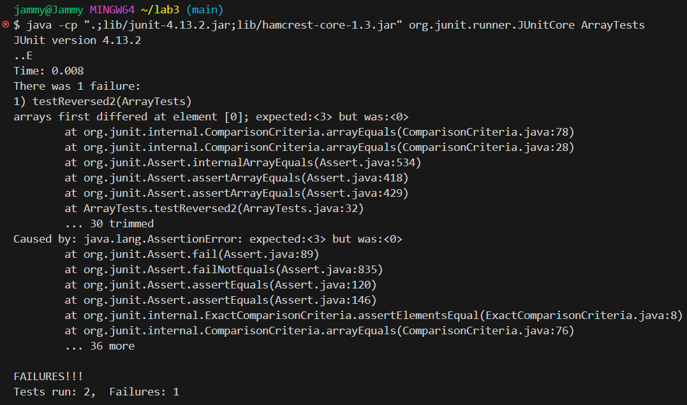

# Lab Report 3  

# Part 1  
1. A failure-inducing input for the buggy program method ``reversed`` in ``ArrayExamples.java`` from week 4's lab:  
   ```
   @Test
   public void testReversed2() {
     int[] input2 = { 1, 2, 3 };
     assertArrayEquals(new int[]{ 3, 2, 1 }, ArrayExamples.reversed(input2));
   }
   ```  
2. An input that doesn't induce a failure for this program:
   ```
   @Test
   public void testReversed() {
     int[] input1 = { };
     assertArrayEquals(new int[]{ }, ArrayExamples.reversed(input1));
   }
   ```  
3. The symptom, or the output of running the two tests above:
   
4. The bug, before code change required to fix it:
   ```
   static int[] reversed(int[] arr) {
      int[] newArray = new int[arr.length];
      for(int i = 0; i < arr.length; i += 1) {
         arr[i] = newArray[arr.length - i - 1];
      }
      return arr;
   }
   ```
   The bug, after code change required to fix it:
   ```
   static int[] reversed(int[] arr) {
      int[] newArray = new int[arr.length];
      for(int i = 0; i < arr.length; i += 1) {
         newArray[arr.length - i - 1] = arr[i];
      }
      return newArray;
   }
   ```
5. The bug in the code prior to the change was that the for loop was not actively updating ``newArray``, and instead was trying to update the original array ``arr`` with content from ``newArray``. However, ``newArray`` has no content as it is a newly created array with the same length as the original array and as a result, the overall program returns ``arr`` with no changes made. The fix addresses this issue because indices of the ``newArray`` are being updated with contents of each current index from ``arr`` and the overall program returns ``newArray`` with the new changes.

# Part 2  
1. One interesting command-line option to use ``grep`` is ``-c``, which prints count of lines with matching criteria.
   Example 1:
   ```
   //command
   $ grep -c "planes" week5-demo/docsearch/technical/911report/chapter-1.txt

   //output
   16
   ```
   In this example, the command is used to search through the ``chapter-1.txt`` text file in the ``911report`` directory for ``planes`` and count how many lines contain this string. This is useful because
     
   Example 2:
   ```
   //command
   $ grep -r -c "planes" week5-demo/docsearch/technical/911report
   
   //output
   week5-demo/docsearch/technical/911report/chapter-1.txt:16
   week5-demo/docsearch/technical/911report/chapter-10.txt:0
   week5-demo/docsearch/technical/911report/chapter-11.txt:3
   week5-demo/docsearch/technical/911report/chapter-12.txt:1
   week5-demo/docsearch/technical/911report/chapter-13.1.txt:1
   week5-demo/docsearch/technical/911report/chapter-13.2.txt:5
   week5-demo/docsearch/technical/911report/chapter-13.3.txt:1
   week5-demo/docsearch/technical/911report/chapter-13.4.txt:13
   week5-demo/docsearch/technical/911report/chapter-13.5.txt:6
   week5-demo/docsearch/technical/911report/chapter-2.txt:0
   week5-demo/docsearch/technical/911report/chapter-3.txt:2
   week5-demo/docsearch/technical/911report/chapter-5.txt:30
   week5-demo/docsearch/technical/911report/chapter-6.txt:2
   week5-demo/docsearch/technical/911report/chapter-7.txt:20
   week5-demo/docsearch/technical/911report/chapter-8.txt:2
   week5-demo/docsearch/technical/911report/chapter-9.txt:3
   week5-demo/docsearch/technical/911report/preface.txt:0
   ```
   In this example, the command is used concurrently with ``-r``, which is a command-line option that searches recursively through a directory path, in this case, it scans through ``911report`` for ``"planes"`` and returns the amount of lines that contain this string for each text file in the directory. This is useful because
     
2. Another interesting alternate way of using ``grep`` is ``-v``, which prints lines not matching criteria.
   Example 1:
   ```
   //command
   $ grep -v "a" week5-demo/docsearch/technical/biomed/1468-6708-3-1.txt

   //output
   Introduction
        elderly [ 9 ] .


          Study


          ] .
          (for persons who were never in excellent, very good, or
          report results using only the simpler definition.
          findings.


        Results
        likely.
        from 25 to 29.9. The second column, which shows results
        under 20.
        groups.
        YOL or YHL.


        Discussion


          YHL.


        Conclusion
        'overweight' by the NHLBI guidelines. This suggests using


        Competing interests


        CESD Center for Epidemiologic Studies Depression
        poor?
   ```
   In this example, the command is used to search through a text file in ``biomed`` and print lines that do not contain the string ``a``, which explains the sporadic gaps between lines as it excludes those containing the string. This is useful because

   Example 2:
   ```
   //command
   $ grep -vi "a" week5-demo/docsearch/technical/biomed/1471-2148-1-1.txt
   
   //output
   viruses is the production of two types of virions [ 1].
        One, the occlusion derived virion (ODV) type, is present in
        infection between cells within insects or in cell culture.
        their envelope proteins. The envelope of ODV is not well
        vesicles when exposed to low pH.
        Homologs of
        homology to
        SeMNPV [ 7].
        Homologs of
        the sequenced
        gp64 -minus viruses including LdMNPV,
        SeMNPV [ 8],
        function of the
        ld130 homologs [ 3].
        retrovirus-like elements from
        proteins for these two groups of viruses.


        Results

          gypsy group [ 18]. The exception is
          retroelement.


          This led to the grouping of the sequences into six
          the
          homology.
          eight


          represented by
          tom in Fig. 4, four of the
          4.
          site shown in Fig. 5.
          protein cg4715.


        Discussion
        retrovirus-like
        gypsy envelope proteins, the

        gypsy -derived envelope proteins
        predicted from studies of other
        of this protein group.
        elements.
        gypsy retrovirus-like
        well.


        Conclusions
        of
        viruses.


        unit.
   ```
   In this example, the command is used concurrently with ``-i``, which is a command-line option that prints lines with matching criteria while ignoring upper or lower casing, so the text file was scanned through for ``a`` and excluded those lines that contain it whether or not the string is upper or lower case when printing the output. This is useful because

3. A third interesting command-line option to use ``grep`` is ``-i``, which prints lines with matching criteria while ignoring upper or lower casing.
   Example 1:
   ```
   //command
   $ grep -i problems week5-demo/docsearch/technical/government/Alcohol_Problems/Session2-PDF.txt
   
   //output
   Identifying ED Patients with Alcohol Problems
   problems, and they can be identified.1 Research on techniques used
   Alcohol problems defined
   Alcohol problems designate a spectrum from risk behavior to
   problems will be detected. High specificity is also desirable to
   help ensure that positive tests represent real problems. There is a
   designed for patients with more severe problems (6 drinks) will be
   less sensitive at identifying patients with less severe problems (3
   ED problems, such as stress, injury, acute illness, intoxication,
   would address both current and lifetime alcohol problems. Current
   predicts poor outcome from medical problems such as injury.9
   diagnosis, but clinical impressions concerning alcohol problems can
   patients with alcohol problems. Unfortunately, the majority of
   a sensitivity of 29% for alcohol problems in the ED.7
   problems over the patient's lifetime. CAGE takes 1 to 2 minutes to
   addresses problems over the patient's lifetime. MAST requires 20
   computerized format. It addresses problems over the patient's
   has 10 questions. It assesses problems experienced within the last
   addresses problems over the patient's lifetime, and takes 3 to 5
   problems over the patient's lifetime and takes 1 to 2 minutes to
   to address current problems (the past year or three months) rather
   than lifetime problems. Screening with embedded questions and
   problems may motivate patients to seek counseling. Providing
   rates. EDs have reported high case rates of alcohol problems,
   medical problems like gastrointestinal bleeding or seizures define
   problems in most EDs.
   Physician's Guide to Helping Patients with Alcohol Problems.
   7. Cherpitel C. Screening for alcohol problems in the emergency
   problems between black and white emergency room patients from two
   alcohol problems in the emergency department, part 1: improving
   alcohol-related problems in general practice. J Stud Alcohol
   consumption and related problems among primary health care
   drinking in the emergency room: the RAPS4. Rapid Alcohol Problems
   problems in primary care: a systematic review. Arch Intern Med
   instruments for alcohol problems in the emergency room. J Stud
   problems in older persons: determinants, consequences, and
   66. Peters J, Brooker C, McCabe C, Short N. Problems
   problems in patients attending an accident and emergency
   ```
   In this example,

   Example 2:
   ```
   //command
   $ grep -ci problems week5-demo/docsearch/technical/government/Alcohol_Problems/Session2-PDF.txt
   
   //output
   38
   ```
   In this example,
     
4. Lastly, another interesting alternate way of using ``grep`` is ``-A n``, which prints n lines after matches.
   Example 1:
   ```
   //command
   $ grep -A 2 could week5-demo/docsearch/technical/plos/journal.pbio.0020053.txt
   
   //output
   one could clone, express, and test with other substrates. I view that as the kind of thing
   we should do,” he says. For example, Walsh suggests, it is a reasonable approach to
   second-generation improvement of daptomycin, the antibiotic most recently approved for sale
   --
   homogeneity could be a problem too,” he adds. “So even though it will work, I think they'll
   have an uphill battle.” Phage may well enter agricultural or veterinary use, he predicts,
   but are probably not going to be available to patients in the United States any time
   --
   to treat, but more important, we'd have a reagent that could treat people who walk out the
   door of the hospital to eliminate or reduce the transmission of resistant organisms into
   the community. We don't have that capability right now.”
   --
   significantly resistant, phage enzymes could buy researchers decades for inventing other
   approaches.
   ```
   In this example,

   Example 2:
   ```
   //command
   $ grep -cA 2 could week5-demo/docsearch/technical/plos/journal.pbio.0020053.txt
   
   //output
   4
   ```
   In this example,
