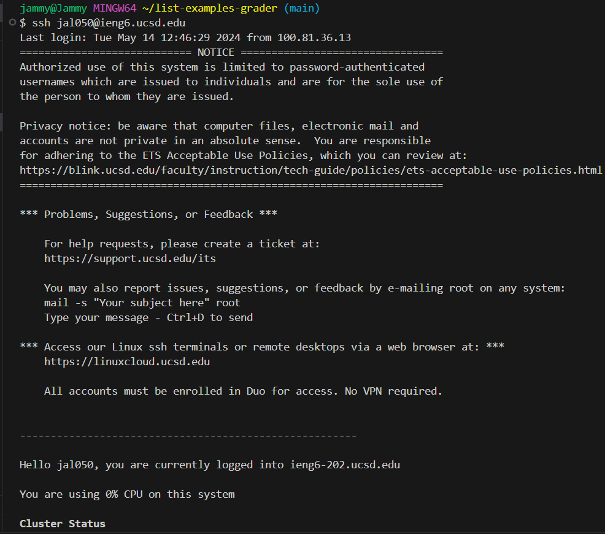

1. Keys pressed: ``ssh jal050@ieng6.ucsd.edu <enter>``. This command logs us into the ieng6 server.
      
2. Keys pressed: ``git clone git@github.com:jammyegg/lab7.git <enter>``. This command clones our fork of the repository from our Github account using the SSH URL.
     
3. Keys pressed: ``cd lab7 <enter>``, ``bash test.sh <enter>``. After cloning our fork, we must be in the ``lab7`` directory before running tests. The first set of key presses gets us in the ``lab7`` folder. The second command runs the tests in ``lab7``, which show that one test failed.
     
4. Keys pressed: ``vim ListExamples.java <enter>``, ``44G i <right><right><right><right><right><right><backspace> 2 <esc> :wq <enter>``. The first command helps us edit the code in Vim. The bug in the code is in line 44, therefore ``44G`` returns us to the beginning of line 44. Then, we enter insert mode with ``i`` and submit 6 right or ``l`` key presses to get to the end of what was originally ``index1`` before backspacing once to delete ``1`` and replace with ``2``. To save these changes, we use the command ``:wq`` to save the file and exit the Vim editor.
     
5. Keys pressed: ``<up><up><enter>``. We want to run the tests again with this new change, and we've ran tests previously before making changes, therefore we can access that command again with 2 key presses up with arrow keys because it was 2 up in the search history. This shows that all tests passed.
     
6. Keys pressed: ``git add . <enter>``, ``git commit -m "Changed index1 to index2" <enter>``, ``git push origin main <enter>``. The first command tells Git what changes I want to include in the next commit, which is all changes in the current directory and its subdirectories. The second command commits these changes to the repository and saves a snapshot of them. The message that comes along with this commit describes what changes have been made. The third command pushes the changes to actually appear on GitHub.
   
